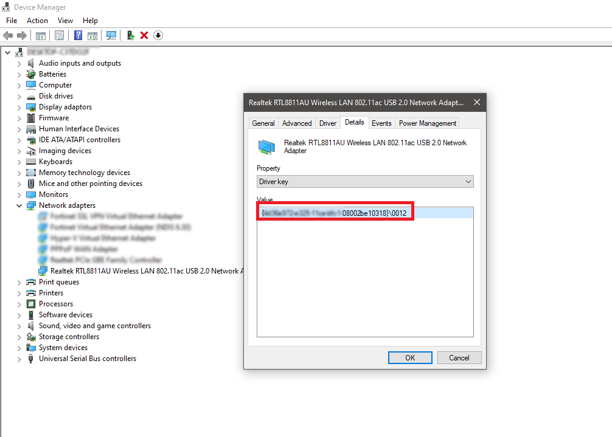
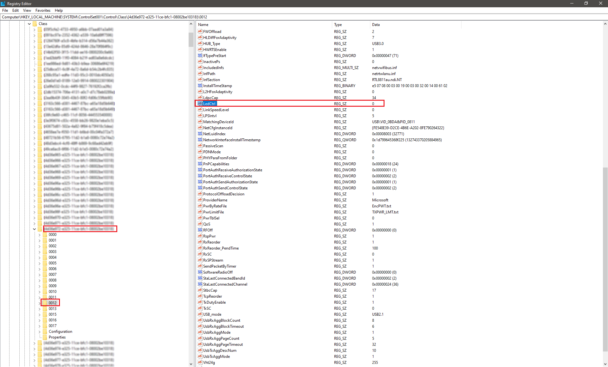

## How to disable blinking LED indicator for USB dongle on Windows (Alfa Network AWUS036ACS in my case).

1. Go to Device Manager and search for USB dongle.Open properties and search for Driver key entry.

2. Search for Driver key in Registry editor. Inside driver node search for key that might controll LEDs activity. In my case LedCtrl. Change its value to 0 (in my case).

